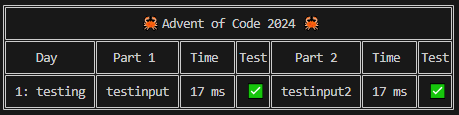

# Advent of Code 2024 Automated Directory Setup (Rust)

## Rust Installation

Rust should be installed on your system already. Also, make sure that you have a C linker installed, usually doing 
```
sudo apt-get update
sudo apt install build-essential
sudo apt install gcc
```
will work. Then, check that it is installed with
```
cc --version
```

## Template

The blank template for future Advent of Code setups can be found in the [https://github.com/dillionlim/advent-of-code-2024/tree/template](template branch).

## Running the directory setup

Enable the script to be run by running:
```
chmod +x setup.sh
```

Then, create a new directory for the problems in day $x$ by doing 
```
./setup.sh -n <x> <Problem_Name>
```

In general, I like to use the convention $x$a for the first star problem, and $x$b for the second star problem. So, the two problems on day 1 would be set up with $1a$ and $1b$.

## Performing Testing

To run tests on the test cases that you have input in /day_n/test_cases.toml, simply run
```
cargo test
```

If all tests have succeeded, you should see something like
```
test run_all_toml_test_cases ... ok

test result: ok. 1 passed; 0 failed; 0 ignored; 0 measured; 0 filtered out; finished in 2.96s
```

If certain tests have failed, you should see something like
```
---- run_all_toml_test_cases stdout ----
Test case 1 failed in src/day_2/day_2b/test_cases.toml
 input: "7 6 4 2 1
1 2 7 8 9
9 7 6 2 1
1 3 2 4 5
8 6 4 4 1
1 3 6 7 9"
 expected: "2"
 output: "4"
```

## Running it on the given input

To run it on the given input for the day itself, simply put the input into input.txt and run 
```
cargo run
```

This will give you the results in the form of a table.



This shows the solution to the part, the time it took to run, and whether it passed all sample testcases (given by the emojis).

## Disclaimers

By default, input.txt is added to .gitignore as per request by the Advent of Code website, "If you're posting a code repository somewhere, please don't include parts of Advent of Code like the puzzle text or your inputs." As a result, I will only be posting abridged problem statements.