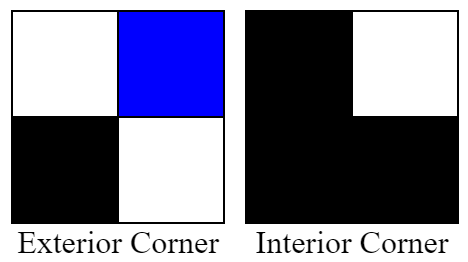

# Day 12: Garden Groups

## Input Bounds

It appears that the input is a grid of uppercase alphabetic characters.

## Part A

### Abridged Problem Statement

Given an input grid, for each connected component, find the perimeter and area of the connected component. Find the sum of the product of the perimeter and area for all connected components.

### Solution

We perform a standard BFS flood-fill search on the grid. 

* The area is the number of tiles that are covered in the BFS flood-fill search.
* The perimeter can be determined during the BFS by counting the number of tiles that are "invalid" in our search, that is, either out-of-bounds, or is a different character.

We make use of a `visited` array to make sure that we do not revisit tiles that have already been visited.

### Code Complexity

**Time Complexity:** $O(M \times N)$
* $M$ is the number of rows in the grid.
* $N$ is the number of columns in the grid.

Each tile will be visited at most once.

**Additional Space Complexity:** $O(M \times N)$

The grid and the `visited` array both require $O(M \times N)$ space.

**Final answer:** 1483212.

## Part B

### Abridged Problem Statement

Given an input grid, for each connected component, find the number of sides and area of the connected component. Find the sum of the product of the number of sides and area for all connected components.

### Solution

The area can be computed similarly to part A. For the number of sides for each connected component, we need to make use of an important observation.

**Lemma 12.1.** *The number of sides of a non-self-intersecting polygon is equal to the number of corners in the polygon.*

To prove it, we will make use of a weaker lemma, lemma 12.2.

**Lemma 12.2.** *The number of sides of a simple polygon is equal to the number of corners in the polygon.*

*Proof.* A simple polygon is one that is non-self-intersecting and does not have holes.

A polygonal chain with vertices $V_1, V_2, \cdots, V_n$ consists of the line segments $V_1V_2, V_2V_3, \cdots V_{n-1}V_n$. By inspection, we note that there are $n-1$ such line segments.

A polygon can be formed a closed polygonal chain, that is, a polygonal chain with vertices $V_1, V_2, \cdots, V_n, V_{n+1}$ such that $V_{n+1} \equiv V_1$ and all other vertices are distinct. Since the polygonal chain of length $n+1$ has $(n+1) - 1 = n$ line segments, it follows that the number of sides of a simple polygon is equal to the number of vertices (or corners) in the simple polygon. $\blacksquare$

Now, we will proceed with the proof for lemma 12.1.

**Lemma 12.1.** *The number of sides of a non-self-intersecting polygon is equal to the number of corners in the polygon.*

*Proof.* A non-self-intersecting polygon can be represented as an exterior boundary, which is a simple polygon, with zero or more interior boundaries, which are also simple polygons, all of which are mutually nonoverlapping.

We consider the total number of edges of the non-self-intersecting polygon to be the sum of the number of edges of the exterior boundary and the sum of the number of edges of the interior boundaries, all of which are simple polygons. We know from **lemma 12.2** that for a simple polygon, the number of edges is equal to the number of corners in the polygon. 

Let the outer boundary have $E_o$ edges and $C_o$ corners. Let there by $h$ holes (inner bounadries), and each hole's boundary has $E_i$ edges and $C_i$ corners, for $i = 1, 2, \cdots, h$.

Then, for the entire shape, let $E$ be the total number of edges in the shape, and $C$ be the total number of corners in the shape.

$$
\begin{aligned}
  E &= E_o + \sum_{i=1}^h E_i\\
  &= C_o + \sum_{i=1}^h C_i\\
  &= C
\end{aligned}
$$

where the second line holds due to **lemma 12.2**. Hence, for non-self-intersecting polygons, the number of edges is also equal to the number of corners in the polygon. $\blacksquare$

Therefore, counting the number of sides for this part simply boils down to counting the number of corners in each connected component.

There are two kinds of corners, exterior corners (those that form a $270 \degree$ exterior angle) and interior corners (those that form a $90 \degree$ exterior angle).

Note that for the exterior corner, we simply need to check if the two orthogonal neighbours are both different from the current tile. Note that the blue tile does not matter, and it can be identical to the current tile.

For the interior corner, however, we need to check if the two orthogonal neighbours are both identical to the current tile, **and the corner tile** must be different from the current tile.

### Code Complexity

**Time Complexity:** $O(M \times N)$
* $M$ is the number of rows in the grid.
* $N$ is the number of columns in the grid.

Each tile will be visited at most once.

**Additional Space Complexity:** $O(M \times N)$

The grid and the `visited` array both require $O(M \times N)$ space.

**Final answer:** 897062.
